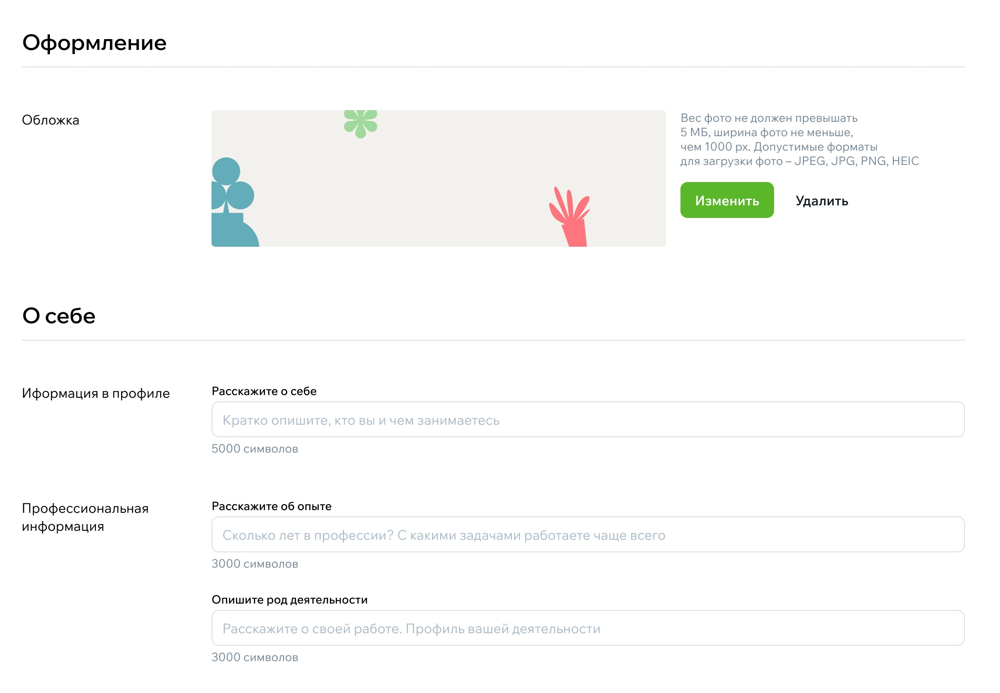
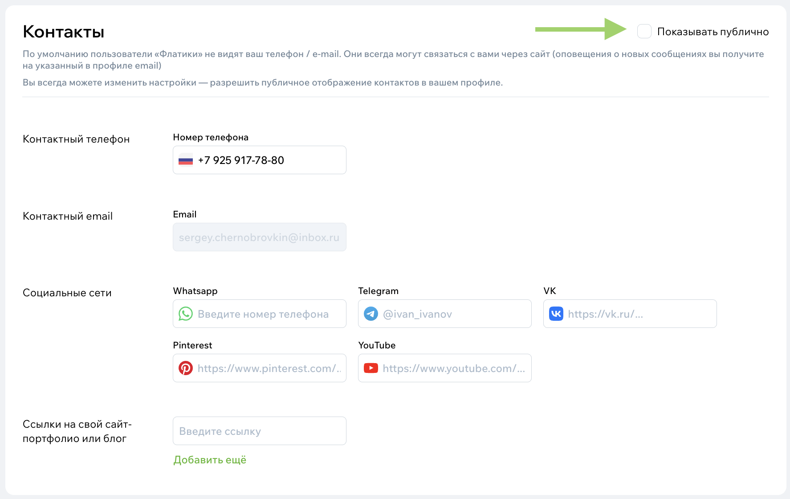

# Профиль эксперта: как его оформить и управлять им

Профиль на Флатике — это ваша профессиональная витрина.  
Через него пользователи узнают о вас, смотрят проекты, оценивают стиль работы и решают, готовы ли написать вам заявку. Хорошо оформленный профиль работает как сайт-портфолио, только проще и быстрее.

## Зачем вам профиль эксперта

Профиль помогает решать сразу несколько задач:

- показать уровень работ без слов и презентаций;
- рассказать пользователям, чем вы занимаетесь и в каком формате работаете;
- собирать отзывы и укреплять доверие;
- получать заявки от людей, которые уже посмотрели ваши проекты и как минимум понимают, кто вы;
- попадать в подборки, фотопоток и редакционные статьи — платформа часто подбирает контент, основываясь именно на профиле эксперта.

## С чего начать

Перейдите в [свой профиль](../Начало-работы/Настройки-профиля-пользователя.md) и нажмите **«Редактировать»**.  
Страница редактирования разделена на несколько логичных блоков — удобно идти по порядку.

## Имя, город и обложка — первое впечатление

То, что пользователь видит в первые секунды:

- имя или название студии;
- ваш город (или несколько городов, если работаете в разных регионах);
- аватар и обложка;
- специализация.

Эти элементы задают настроение профиля.  
Обложка особенно важна: это первое изображение, по которому человек считывает стиль.

> Совет: выбирайте такое фото, которое действительно отражает ваш почерк.

{style="display:block; margin:auto;" }

## Блок «О себе» и «Профессиональная информация»

Это небольшой текст, но он хорошо работает на доверие.  
Расскажите, чем вы занимаетесь, какой у вас опыт, какие задачи любите решать. Можно упомянуть подход к работе или то, что выделяет вас среди других.

Не нужно писать длинное эссе — достаточно нескольких честных абзацев, написанных «по-человечески».

{style="display:block; margin:auto;" }

## Контакты

По умолчанию пользователи оставляют вам заявку через форму.  
Но если вы хотите — можете открыть телефон или email.  
Тогда человек сможет написать вам напрямую.

> Важно: если вы открываете контакты, лучше упомянуть, как вам удобнее отвечать — так коммуникация будет проще.

{style="display:block; margin:auto;" }

Укажите ссылки на ваши социальные сети или свой сайт –– так вы сможете получить новых подписчиков с помощью платформы.

## Что делает профиль сильным

Несколько простых правил:

- живое, понятное описание вместо «креативных пространств и нестандартных решений»;
- качественные фотографии проектов, без коллажей и длинных полос;
- ясные услуги, ориентиры по цене;
- реальные отзывы;
- обложка и аватар, которые создают ощущение аккуратности;
- актуальная информация (если вы не делаете полный ремонт, лучше не оставлять эту услугу в списке).

Это честная и понятная подача — пользователи очень ценят такие профили.

## Как часто обновлять профиль

Регулярно обновлять не нужно.  
Но если у вас появляется новый проект, свежие фото или отзыв — стоит добавлять.  
Это помогает профилю оставаться живым, а вам — попадать в подборки и поисковую выдачу.

## Если что-то не получается

Если у вас возник вопрос по оформлению профиля или загрузке проекта — напишите в поддержку. Мы поможем разобраться и подскажем, как лучше оформить страницу.
