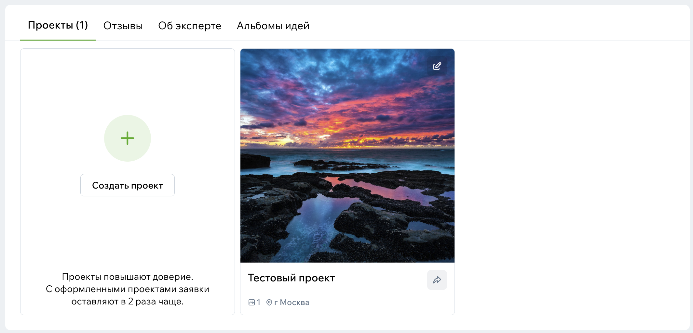
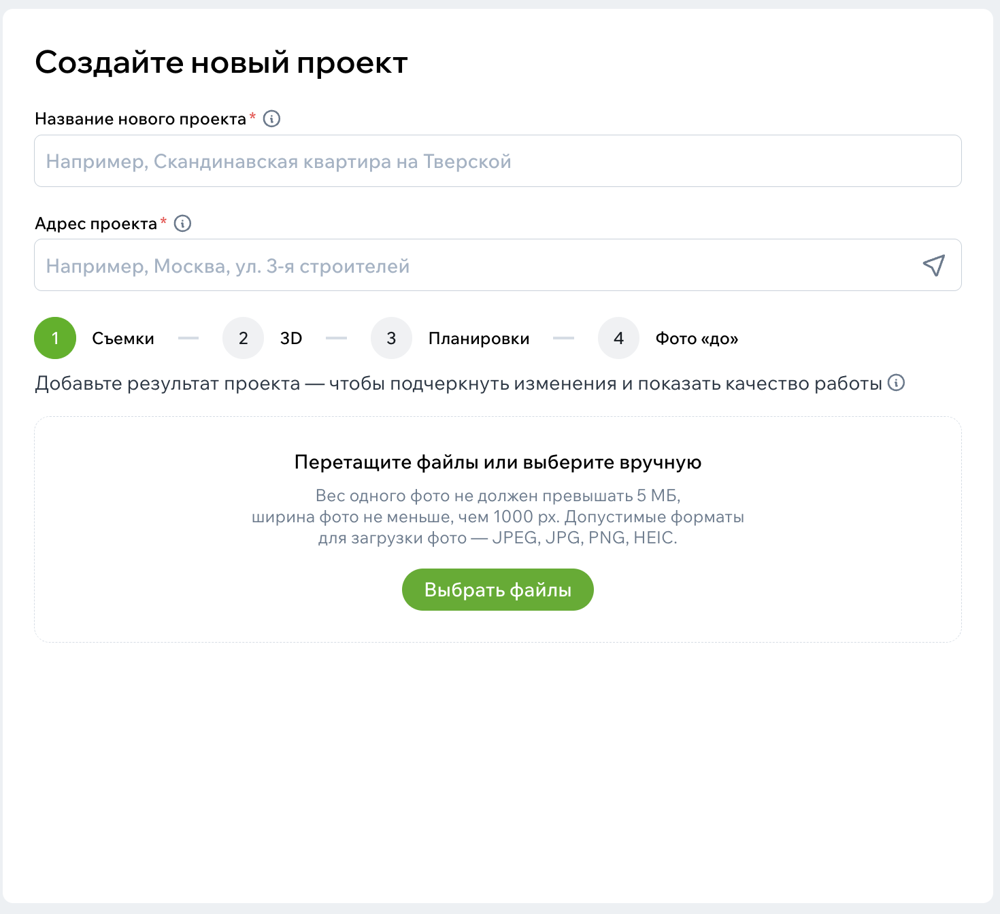
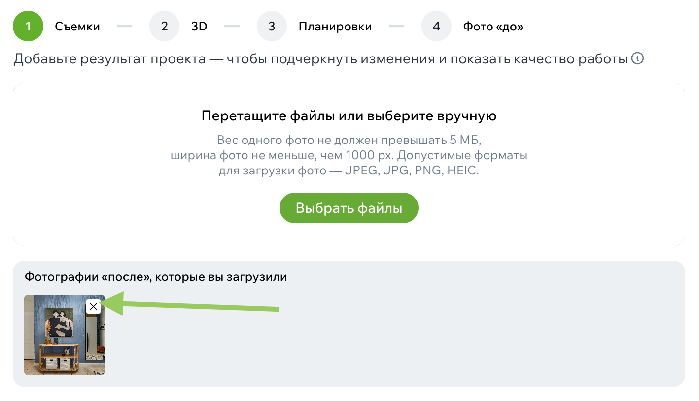
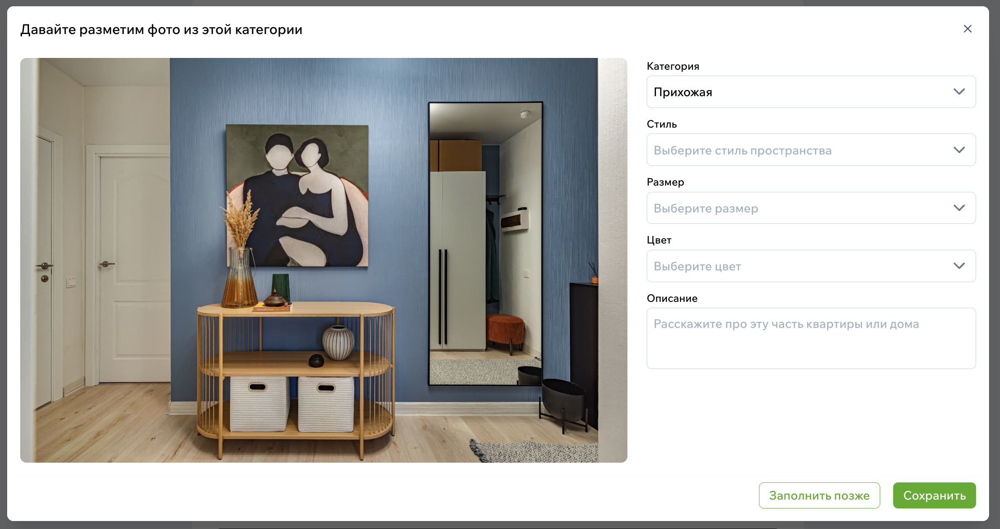
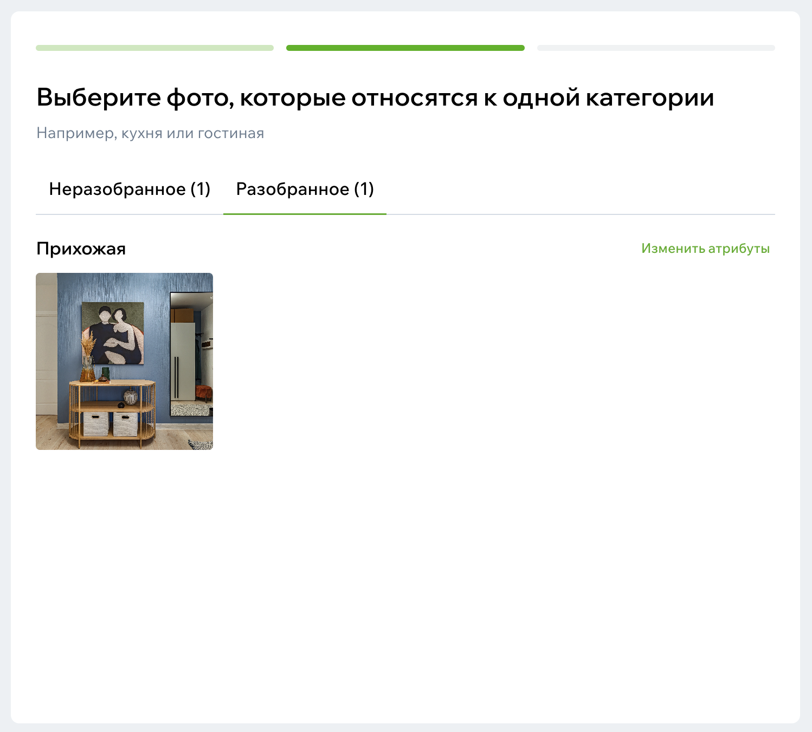

# Как публиковать проекты

Проекты — это сердце вашего профиля.  
Именно здесь люди понимают, кто вы как специалист: как мыслите, какие задачи решаете и какой результат приносите клиентам. Иногда одного хорошо оформленного проекта достаточно, чтобы человек нажал [«Связаться»](../Функционал/Эксперты/Оставить-заявку.md).

## Зачем вообще публиковать проекты

Фотографии сами по себе красивые, но проект — это история. Люди заходят туда, чтобы увидеть не только картинку, но и путь: что было, что стало, почему вы выбрали те или иные решения.

Проекты показывают ваш почерк, подход и аккуратность. Даже если у вас есть всего два–три проекта, они уже могут привести клиентов — главное, чтобы были оформлены честно и аккуратно.

## Что подготовить заранее

Самый простой способ сэкономить время — собрать материалы перед загрузкой. Понадобятся фотографии (желательно качественные и без коллажей), небольшой текст о задаче, параметры объекта и, если есть, планировки.

Не стремитесь написать «роман» — достаточно понятного описания, чтобы человек увидел ваш процесс и почувствовал, что вы знаете, что делаете.

## Как создать проект

Всё начинается с кнопки **«Создать проект»** в вашем профиле в разделе проектов.
После неё откроется мастер создания. Двигайтесь по порядку, и проект будет собран буквально за несколько минут.

{width=500, style="display:block; margin:auto;" }

### Шаг 1. Название и адрес проекта

Введите название проекта и адрес реализации. Название можно поменять впоследствии, но название, введенное при создании, будет влиять на публичную ссылку на проект. Выберите красивое название, отражающее суть проекта.

Адрес поможет пользователям искать проекты в своем городе и районе.

### Шаг 2. Фотографии

Загрузите основные фото:

- финальную съёмку,
- крупные планы,
- интересные решения.

{width=500, style="display:block; margin:auto;" }

Когда будете загружать снимки, подумайте о темпе просмотра. Лучше поставить первые несколько фото так, чтобы они задавали правильное впечатление: общий вид, хорошая перспектива, пара красивых деталей.

Если у вас есть фото «до» или визуализации, их тоже можно добавить — пользователям всегда интересно, как пространство менялось.

После загрузки порядок фото можно менять, пока всё не станет на свои места.

Каждая фотография автоматически появится и на своей отдельной странице, и, возможно, в фотопотоке, если модераторы отберут ее.

Для удаления нажмите на крестик в правом верхнем углу нужной фотографии

{width=500, style="display:block; margin:auto;" }

### Шаг 3. 3D-визуализации, планировки и фото «до»

После загрузки основных фотографий проекта и установки названия и адреса, появится активная кнопка «Далее».
Нажмите на нее, чтобы перейти к загрузке 3D-визуализаций. Загрузите фото или перейдите на следующий шаг –– планировки и фото «до».

{width=500, style="display:block; margin:auto;" }

После загрузки фотографий, проект будет создан. Вы можете продолжить оформление проекта.

{width=500, style="display:block; margin:auto;" }

### Шаг 4. Оформление

Перед вами откроется форма оформления проекта.

{width=500, style="display:block; margin:auto;" }

**Описание** — это небольшая история о том, что происходило. Расскажите, какая была задача, что нужно было учесть, было ли что-то сложное, и что в итоге получилось.

Это текст, который помогает почувствовать ваш профессиональный стиль: спокойный, уверенный, без слишком сложных терминов.

Напишите:

- какая стояла задача,
- какие особенности были у помещения,
- какие решения вы предложили,
- что было важным для заказчика,
- что получилось в итоге.

Несколько цифр и фактов работают лучше, чем кажется. Это помогает проекту попадать в подборки и фильтры, и даёт пользователю ощущение конкретики.

Укажите базовые данные:

- ключевые слова,
- стиль,
- год реализации,

Вы также можете указать ориентировочную стоимость проектирования и реализации.
Это не обязательно, но очень полезно для тех, кто ищет специалиста в своём бюджете.

Если о вашем проекте выходила статья в СМИ или на UGC-площадках, добавьте ссылки на них. Они будут красиво дополнять страницу вашего проекта и помогут пользователю углубиться в детали реализации.

После заполнения формы нажмите «Далее», чтобы перейти к следующему шагу.

### Шаг 5. Разметка фотографий

Чтобы ваши фотографии попали в фотопоток, необходимо их разметить –– выбрать категорию фото (например, кухни, гостиные или спальни) и указать основные атрибуты фото.

Нажмите на фотографии, относящиеся к одной категории. Под ними появится меню с выбором категории. Выберите нужную категорию и нажмите «Сохранить» рядом с категорией.

{width=500, style="display:block; margin:auto;" }

После этого откроется форма заполнения атрибутов выбранной категории. Вы сможете заполнить атрибуты позже, но мы рекомендуем заполнить основные из них сразу.

{width=500, style="display:block; margin:auto;" }

После нажатия кнопки «Сохранить» заполненные параметры установятся сразу для всех выбранных фотографий. Это позволит сэкономить время и не заполнять одинаковые значения для разных фото из одной категории.

После сохранения выбранные фото переместятся в раздел «Разобранное». Вы можете изменить значения атрибутов для категории с помощью нажатия кнопки «Изменить атрибуты» или перейти обратно в раздел «Неразобранное», чтобы разметить оставшиеся фотографии.

{width=500, style="display:block; margin:auto;" }

Чтобы перейти к следующему шагу нажмите «Сохранить» внизу страницы.

### Шаг 6. Документы проекта

На последнем шаге вы можете загрузить схемы, эскизы, планировки, коллажи или любые другие документы по проекту. Они будут отображаться на странице проекта в виде файлов после раздела фотографий и пользователи смогут скачать их себе.

{width=500, style="display:block; margin:auto;" }

После загрузки, нажмите «Далее».

## Что будет после публикации

Как только проект сохранён, он появляется [в вашем профиле](../Функционал/Эксперты/Проекты.md) и становится доступен пользователям. Отдельные фотографии после модерации попадут и в фотопоток.

Люди смогут просматривать проект, сохранять фотографии в альбомы, задавать вопросы и, главное, переходить в ваш профиль, чтобы оставить заявку.

Вы можете вернуться к редактированию или добавить новые фото и документы прямо на странице проекта.

## Несколько советов напоследок

Лучше меньше фотографий, но качественных.  
Лучше короткий текст, но понятный.  
Лучше один сильный проект, чем пять хаотичных.

Самое важное — чтобы проект был оформлен с заботой о человеке, который его смотрит. Тогда он действительно работает.
