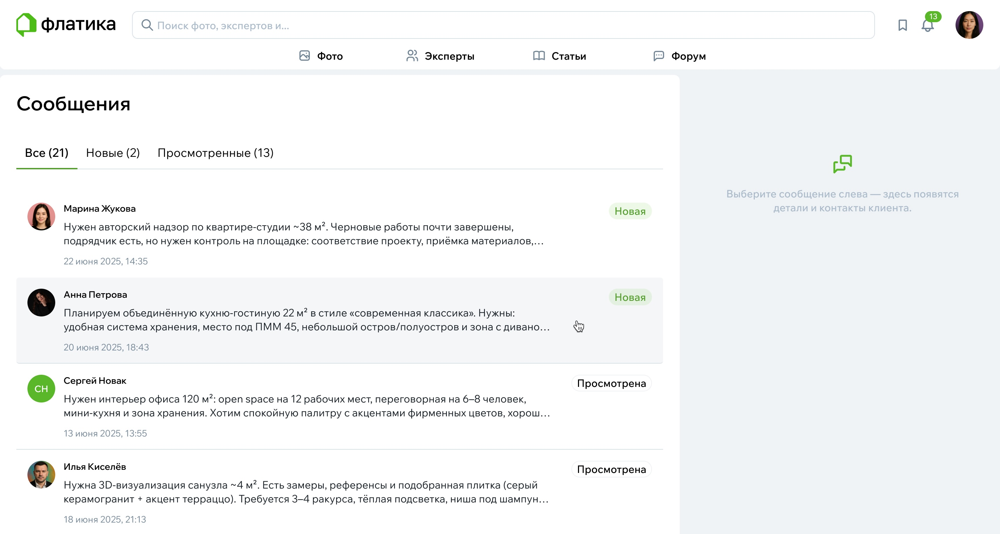
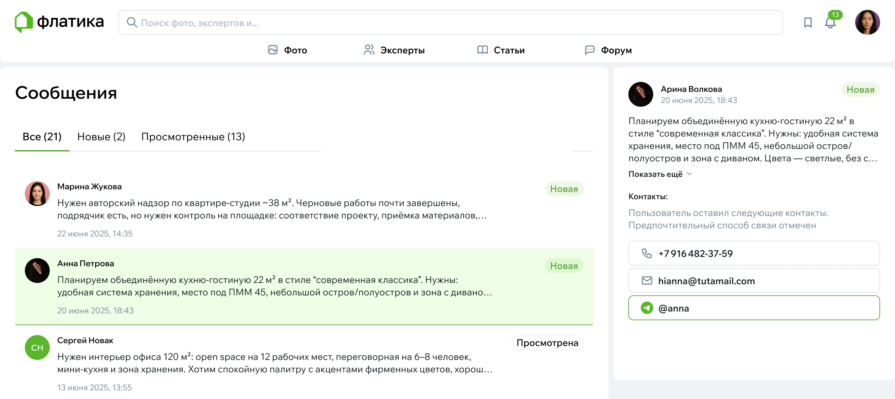

# Обработка заявок: как работать с обращениями клиентов

Заявки — это главная точка контакта между вами и будущими клиентами.  
Человек смотрит ваши проекты, формирует впечатление, и если ему всё подходит — нажимает кнопку [«Связаться»](../Функционал/Эксперты/Оставить-заявку.md).  
От того, как вы обработаете заявку, часто зависит, состоится ли сотрудничество.

## Как приходит заявка

Когда кто-то заполняет форму «Связаться», вы видите заявку в своём [личном кабинете](./Профиль-эксперта.md).  
Там отображается всё, что написал пользователь: описание задачи, метраж, сроки (если он их указал), пожелания и контакт, по которому удобнее всего продолжить разговор.

Заявка — это не формальный документ.  
Это просто сообщение от человека, который хочет разобраться в своём проекте и ищет специалиста, с которым будет комфортно работать.

Перейдите в раздел «Сообщения» в верхнем меню или из настроек аккаунта, чтобы перейти к заявкам.

{width=800, style="display:block; margin:auto;" }

Все заявки делятся на 3 вкладки: Все, Новые и Просмотренные. Новые заявки помечаются тегом «Новое», чтобы вы сразу обратили на них внимание.

Кликните на заявку, чтобы посмотреть содержимое. Сообщение пользователя и его контакт отобразятся в правой части экрана.

{width=800, style="display:block; margin:auto;" }

После открытия заявка перейдет во вкладку «Просмотренные».

## Как лучше всего отвечать

Самое важное — отвечать спокойно, по существу и не слишком долго ждать.  
Пользователь, скорее всего, написал нескольким специалистам сразу. Если вы отвечаете быстро и внятно, это уже преимущество.

Хороший ответ обычно состоит из двух вещей:

1. короткого приветствия и подтверждения, что вы получили задачу,
2. уточняющих вопросов — тех, которые действительно помогут понять контекст.

Иногда достаточно просто попросить планировку или пару фотографий, чтобы продолжить диалог более предметно.

### Стоит ли сразу говорить стоимость

Если у вас в профиле указаны цены — человек уже видел ваш ориентир.  
Но если задача нестандартная, можно честно написать:  
«Чтобы точно назвать стоимость, мне нужно увидеть планировку / получить пару деталей / понять объём работ».

Люди нормально относятся к таким сообщениям — главное, чтобы тон был спокойный и заинтересованный.

### Как организовать дальнейшее общение

После первого ответа обычно начинается короткая переписка.  
Её цель — понять, подходит ли вам задача и комфортно ли работать вместе.

Если нет — лучше честно сказать об этом. Пользователь это ценит и не тратит время впустую.

### Что делать, если задача не по вашему профилю

Это бывает.  
В таком случае корректно ответить, что вы не берёте такие проекты, и, если хочется, подсказать, к кому можно обратиться.

Даже такой ответ создаёт хорошее впечатление — человек видит, что перед ним профессионал.

### Если пользователь пропал

Это тоже нормальная ситуация.  
Люди могут сомневаться, консультироваться с близкими или просто забывать написать. Не воспринимайте это на свой счёт.

Можно один раз напомнить о себе через день-два. Если ответа нет, лучше оставить всё как есть.

## Несколько советов напоследок

— отвечайте коротко и по делу, без длинных вводных;  
— не бойтесь уточнять детали — это покажет ваш профессиональный подход;  
— соблюдайте дружелюбный и спокойный тон;  
— ставьте точку в разговоре, если понимаете, что задача вам не подходит.
