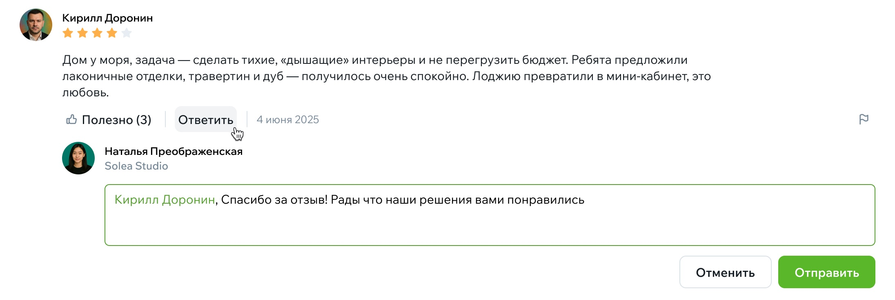
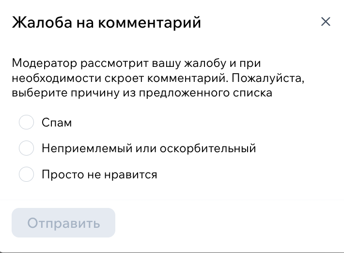

# Работа с отзывами: как эксперт может использовать их с пользой

Отзывы — это не просто оценки под профилем.  
Это один из самых сильных инструментов доверия, который есть у эксперта на Флатике.  
Люди читают отзывы перед тем, как отправить заявку, и часто решение «писать или не писать» зависит именно от них.

## Почему отзывы так важны

Когда человек выбирает специалиста, он не только смотрит проекты — ему важно услышать живой опыт других клиентов: как прошла работа, насколько вовремя всё делалось, как вы общались, понятно ли объясняли решения.

Даже один честный отзыв помогает пользователю почувствовать уверенность.  
А несколько хорошо написанных комментариев работают лучше любой рекламы.

## Где отображаются отзывы

Отзывы видны прямо в вашем [публичном профиле](../Функционал/Эксперты/Профиль-эксперта.md#отзывы), рядом с рейтингом.  
Пользователь открывает карточку специалиста, видит проекты, а затем — опыт других заказчиков.

То, как вы отвечаете на отзывы (или не отвечаете), тоже формирует впечатление о вас. Небольшой, спокойный ответ — признак профессиональности и внимания к клиенту.

## Как появляются отзывы

Оставить отзыв может любой пользователь, который работал с вами и имеет зарегистрированный аккаунт.  
Процесс простой: он заходит в профиль эксперта, нажимает «Написать отзыв», выставляет оценку и пишет свой комментарий.

После этого отзыв проходит модерацию.  
Как только он опубликован, вы сможете при желании ответить.

## Нужно ли отвечать на отзывы

Отвечать необязательно, но очень полезно.
Ответы показывают, что вы уважаете своих клиентов и цените обратную связь.

Если отзыв хороший — поблагодарите, это всегда приятно человеку.  
Если отзыв нейтральный или с замечаниями — можно мягко объяснить ситуацию или уточнить детали, без защиты и резких формулировок.

Главное — спокойный, профессиональный тон. Люди читают такие ответы и делают выводы.

Чтобы ответить на отзыв, нажмите кнопку «Ответить» на выбранном отзыве, введите свой ответ и нажмите «Отправить».

{width=700, style="display:block; margin:auto;" }

## Что делать, если отзыв негативный

Негатив — это не конец света. Наоборот, это шанс показать, что вы умеете решать ситуации корректно.

Рекомендации:

- не спорить и не оправдываться;
- поблагодарить за обратную связь;
- коротко пояснить ситуацию, если есть факты;
- предложить продолжить обсуждение лично, если это уместно.

Очень многие пользователи доверяют специалистам, которые умеют вежливо и по-взрослому отвечать на непростые сообщения.

Если отзыв содержит оскорбления или неправомерную информацию — вы можете подать жалобу, нажав на значок флажка рядом с соответствующим отзывом и выбрав причину жалобы.

{width=300, style="display:block; margin:auto;" }

Модерация рассмотрит ситуацию.

## Можно ли попросить клиента оставить отзыв

Да, если работа завершилась успешно — это абсолютно нормально.  
Большинство хороших отзывов появляются именно потому, что специалист мягко попросил: «Если вам всё понравилось, буду благодарен за отзыв на Флатике».

Люди редко пишут отзывы сами, но почти всегда готовы поддержать специалиста, если работа была хорошей.

## Что делать, если отзыв не появился

Модерация проверяет комментарии в ручном режиме.
Если прошло много времени, а отзыв не отображается:

- уточните у клиента, отправлял ли он его точно из вашего профиля;
- проверьте, не находится ли отзыв в статусе «на рассмотрении»;
- если есть сомнения — напишите в поддержку, мы проверим статус.

## Как отзывы влияют на заявки

Профили с отзывами получают больше заявок — это закономерность.  
Особенно, если в отзывах есть конкретика: что именно вы сделали, как решали задачу, как общались, что получилось в итоге.

Этот раздел профиля работает на вас долго. Даже один качественный отзыв может привести к нескольким новым клиентам.

## Подсказки, которые помогают

— Не бойтесь просить отзыв в конце проекта.  
— Следите за тем, что отзывы показывают в целом: какой образ эксперта они формируют.  
— Старайтесь отвечать — это приятный жест и сильный сигнал профессионализма.  
— Будьте честны: не нужно идеализировать, важно быть живым человеком.
