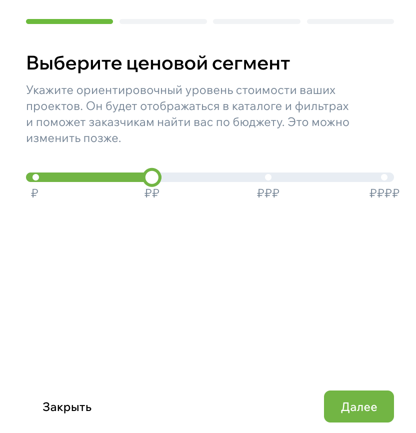
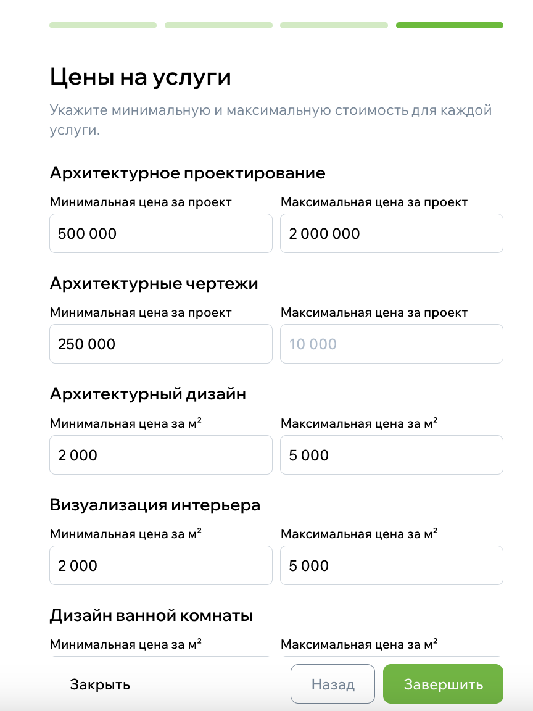
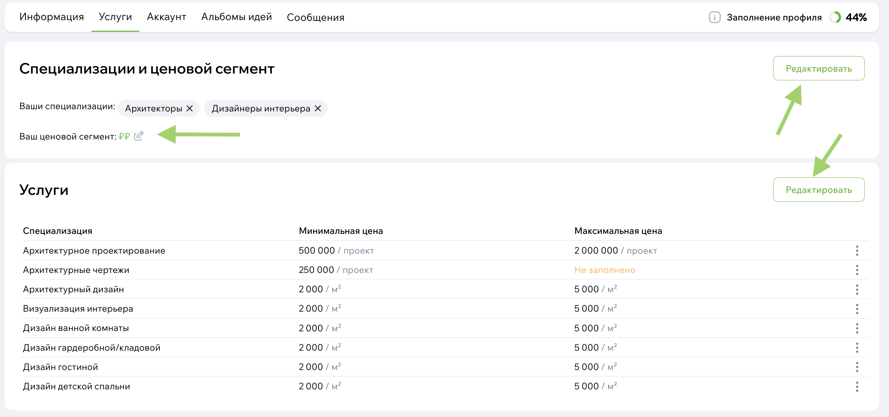

# Услуги эксперта: как настроить и зачем это нужно

Раздел «Услуги» — один из тех элементов профиля, который работает на вас постоянно.  
Он помогает пользователю понять, что именно вы делаете, в каких категориях работаете и на какой бюджет ориентируетесь.  
А главное — услуги влияют на то, попадёте вы в выборку каталога или нет.

В этом документе — простое объяснение, как всё устроено и как настроить услуги так, чтобы профиль работал лучше.

## Зачем вообще заполнять услуги

Пользователь приходит в профиль с очень конкретным вопросом:  
**«Подходит ли мне этот специалист?»**

И услуги дают быстрый ответ.  
По ним человек понимает:

- чем вы занимаетесь,
- какие задачи берёте,
- ориентир по бюджету,
- подходит ли ваша специализация под его запрос.

Фактически, услуги — это фильтр, который приводит к вам «ваших» клиентов, и убирает тех, кому вы всё равно не сможете помочь.

## Как настроить услуги в профиле

Откройте [настройки профиля](../Начало-работы/Настройки-профиля-пользователя.md) и перейдите в раздела «Услуги». Нажмите «Начать настройку», чтобы указать специализацию и услуги.

{style="display:block; margin:auto;" }

### Укажите ценовой сегмент

Первым шагом выберите общий бюджетный уровень, в котором вы обычно работаете.
Это помогает фильтрам каталога подбирать вас в нужные диапазоны.

{width=300, style="display:block; margin:auto;" }

### Выберите специализации

Затем выберите те направления, в которых вы работаете.
Например, если вы дизайнер, можно указать:

- дизайн интерьеров,
- декораторы и стилисты интерьера.

Если вы подрядчик — подойдут категории вроде:

- ремонт и отделка,
- сантехнические работы.

Вы можете выбрать **несколько специализаций**, если работаете в разных областях.  
Доступные варианты показываются из общего справочника.

{width=300, style="display:block; margin:auto;" }

### Выберите доступные услуги

Как только вы выбрали специализации, система автоматически покажет услуги, которые к ним относятся.  
Их не нужно придумывать — весь список определяется справочником.

Нужные услуги можно просто включить — как переключатели.

{width=300, style="display:block; margin:auto;" }

> Важно:  
> если убрать специализацию, услуги, привязанные только к ней, тоже будут удалены (с предупреждением).

### Укажите стоимость услуг

Для каждой выбранной услуги можно указать минимальную и максимальную цену.  
Это необязательно, но сильно помогает пользователю понять ориентиры, а вам –– продвигаться в каталоге экспертов.

Единица измерения услуги подставляется автоматически.

Например:

- «укажите минимальную цену за 1 м²»,
- «укажите максимальную цену за проект».

{width=300, style="display:block; margin:auto;" }

После сохранения настроек специализации и услуги будут отображаться у вас в профиле. Вы можете отредактировать настройки позже в том же разделе:

{style="display:block; margin:auto;" }

## Как услуги влияют на поиск в каталоге

То, какие услуги и цены вы укажете, влияет на то:

- попадёте ли вы в выборку по услугам,
- будете ли подходить под выбранный пользователем бюджет,
- как вас отсортирует фильтр по ценовому сегменту.

Фильтрация учитывает **минимальную и максимальную цену**, которую вы указали.  
А также общий ценовой сегмент («₽», «₽₽», «₽₽₽», «₽₽₽₽»).

Если не указать цены, вы всё равно будете отображаться, но фильтры по бюджету могут вас пропустить.

## Зачем указывать цену честно

Когда пользователь видит реальные цифры:

- меньше ненужных просьб «а скажите стоимость»;
- заявки приходят от людей, которым вы реально подходите;
- уходит меньше времени на предварительные разговоры.

Если вы делаете разные проекты в разном бюджете, укажите вилку — так будет честнее и понятнее.

## Итог

Раздел «Услуги» — не просто формальность.  
Это часть вашего профиля, которая напрямую влияет на то, кто вас увидит, кому вы подойдёте и сколько заявок получите.

Если уделить ей 10–15 минут и заполнить честно и понятно — ваш профиль начинает работать гораздо лучше.
