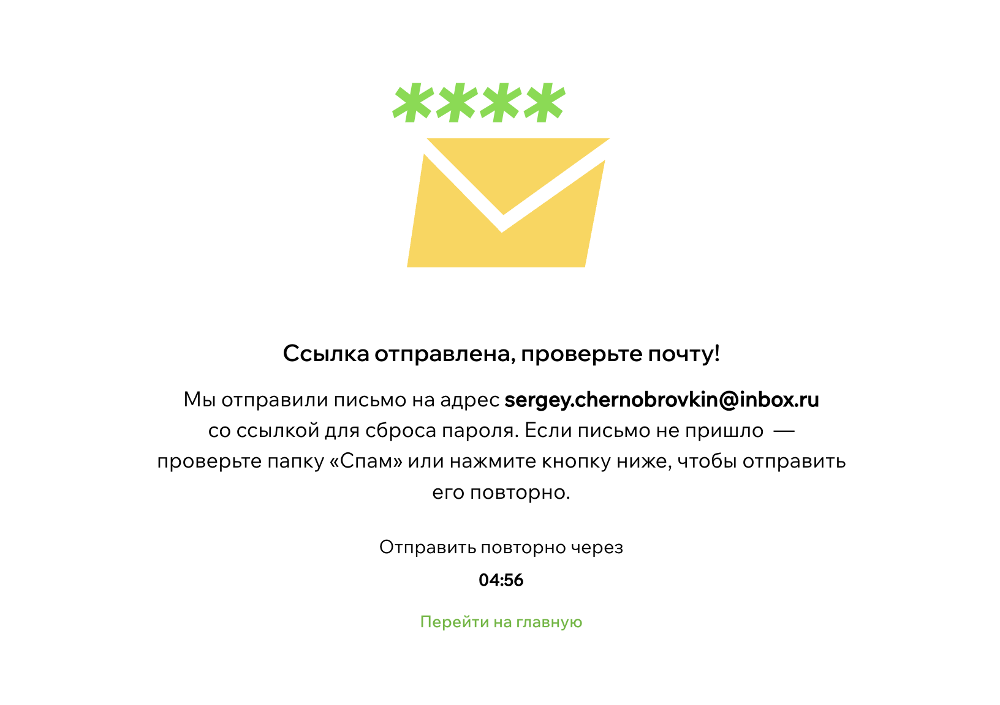
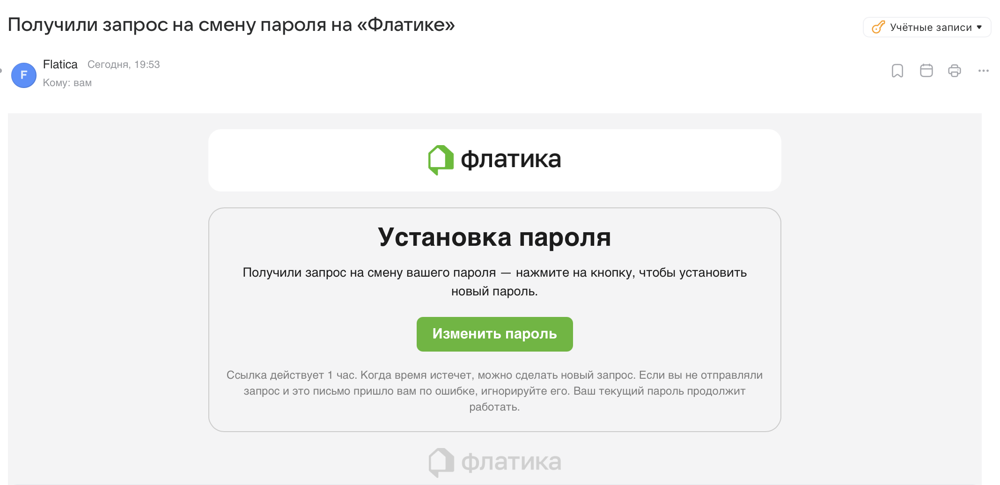
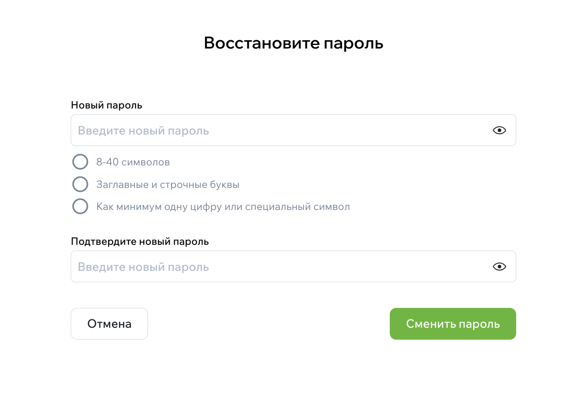

# Как восстановить доступ

Если вы забыли пароль, его можно быстро восстановить. Для этого понадобится доступ к email, который вы указали при регистрации.

## Откройте форму восстановления пароля

На странице входа нажмите ссылку **«Забыли пароль?»**.

{width=400, style="display:block; margin:auto;" }

## Укажите email

Введите адрес электронной почты, на который зарегистрирован ваш аккаунт.  
Нажмите **«Восстановить»**.

{width=400, style="display:block; margin:auto;" }

После отправки вы увидите сообщение, что письмо со ссылкой на восстановление отправлено.

## Перейдите по ссылке из письма

Откройте почту и найдите письмо от Флатики.  
Внутри будет кнопка или ссылка, ведущая на страницу создания нового пароля.

Если письма нет несколько минут — проверьте папки **«Спам»** или **«Промоакции»**.

{width=400, style="display:block; margin:auto;" }
{width=700, style="display:block; margin:auto;" }

## Придумайте новый пароль

После перехода по ссылке откроется форма для ввода нового пароля.  
Пароль должен соответствовать требованиям безопасности (обычно минимум 8 символов).

Введите новый пароль и сохраните его.

{width=500, style="display:block; margin:auto;" }

## Готово — войдите снова

После успешного изменения пароля вы увидите уведомление, что пароль обновлён.  
Теперь можно войти в аккаунт с новым паролем.

## Если письмо не пришло

В форме восстановления можно запросить повторную отправку письма через минуту.  
Если проблема остаётся — свяжитесь с поддержкой.
