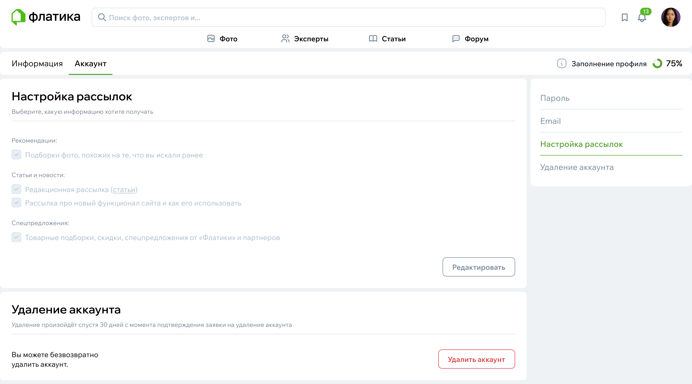
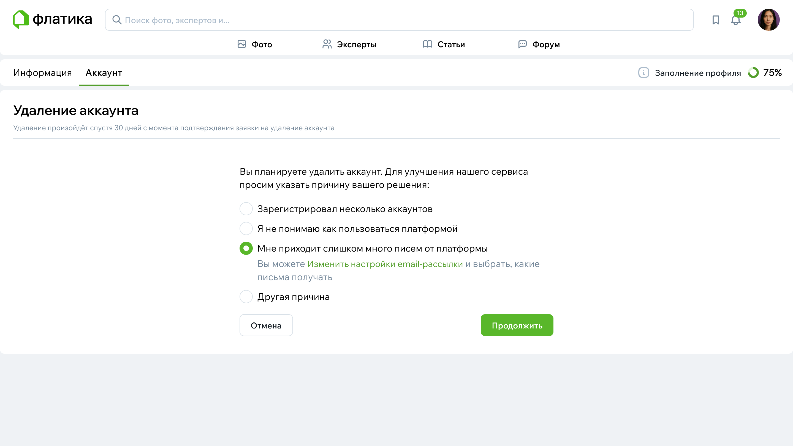

# Настройки аккаунта

## Изменение email

Чтобы изменить адрес электронной почты:

1. Перейдите в раздел **«Аккаунт»**.
2. Нажмите **«Изменить email»**.
3. Укажите новый адрес.
4. Подтвердите действие по ссылке в письме, которое придёт на новую почту.

После подтверждения:

- вход в аккаунт будет выполняться по новому адресу;
- все уведомления также будут приходить на него.

{style="display:block; margin:auto;" }

## Управление рассылками

В разделе "Аккаунт" можно выбрать, какие письма вы хотите получать:

- Рекомендации фото
- Статьи и новости
- Спецпредложения

В разделе "Настройка рассылок" нажмите "редактировать" и выберите только те типы писем, которые вам действительно нужны.

{style="display:block; margin:auto;" }

## Удаление аккаунта

Если вы решили удалить аккаунт:

1. Перейдите в **«Аккаунт»**.
2. Нажмите **«Удалить аккаунт»**.
3. Выберите причину и подтвердите удаление.

После отправки:

- на почту придёт письмо с подтверждением;
- если вы не подтвердите действие в течение 24 часов — заявка отменится;
- у вас есть 30 дней, чтобы отменить удаление, если вы передумаете.

Если вы не отмените удаление — аккаунт будет удалён без возможности восстановления.

{style="display:block; margin:auto;" }
