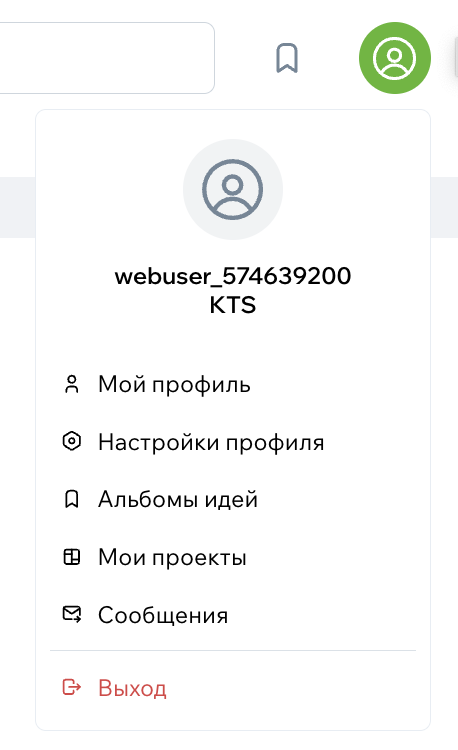

# Настройки профиля пользователя

В настройках профиля вы можете изменить личную информацию, настроить уведомления, обновить email или пароль, а также управлять безопасностью своего аккаунта. Ниже — описание доступных функций на текущий момент.

## Где найти настройки профиля

1. Нажмите на аватар в правом верхнем углу.
2. В выпадающем меню выберите **«Настройки профиля»**.

{width=200, style="display:block; margin:auto;" }

## Общая информация

В этом разделе можно изменить:

- имя и фамилию;
- «о себе»;
- город;
- аватар;
- обложку профиля.

Если вы добавляете ссылки в текст «О себе», при переходе по ним система покажет предупреждение о переходе на внешний сайт (по требованиям безопасности).

### Имя и фамилия

Вы можете указать имя и фамилию, или только имя — формата строгого нет.  
Это основная информация, которую другие пользователи видят первой.

{style="display:block; margin:auto;" }

### Город

Город помогает подбирать релевантные фото и экспертов.  
Вы можете изменить его в любой момент.

### Аватар

Можно загрузить фотографию профиля или заменить её на новую.  
Если аватар не установлен, отображается стандартная заглушка.

### Обложка профиля

Обложка — фоновое изображение в верхней части профиля.  
Можно загрузить своё изображение или оставить стандартный фон.

{style="display:block; margin:auto;" }

### «О себе»

Здесь можно рассказать о себе в свободной форме.  
Если в тексте есть ссылки, система предупредит о переходе на внешний сайт.

{style="display:block; margin:auto;" }

## Контакты

Контакты помогают другим пользователям связаться с вами, если вы сами этого хотите.  
В профиле можно указать только базовую информацию — email для связи остаётся скрытым и используется только для входа и уведомлений.

Ниже — какие контактные данные можно настроить.

{style="display:block; margin:auto;" }

### Номер телефона

Телефон — опциональное поле.  
Если вы укажете номер:

- он появится в вашем профиле (если вы не скрыли его настройками приватности),
- пользователи смогут связаться с вами напрямую.

При вводе используется маска российского номера +7.

### Город

Город относится к контактным данным, потому что влияет на то, какие проекты и специалисты появляются в рекомендациях.

Он также отображается в профиле рядом с вашим именем.

### Ссылки на соцсети

Вы можете указать ссылки на свои соцсети.
Это необязательно — поле отображается по желанию.

Если ссылка ведёт на внешний сайт, при переходе система покажет предупреждение.

### Контакты в профиле эксперта

Если вы эксперт, набор контактных данных шире:

- название компании (если есть),
- номер телефона (опционально),
- рабочие ссылки,
- юр. информация (ИНН, адрес) — только для компаний и брендов.

Юридическая информация отображается отдельно и помогает подтвердить надёжность профиля

### Приватность контактов

Вы можете ограничить, кто видит ваши контактные данные:

- только вы,
- все пользователи,

Если вы ограничите контакты — соответствующие кнопки исчезнут из публичного профиля

### Что контактные данные **не** делают

- **Не влияют на вход.**  
  Для входа используется только ваш email и пароль.

- **Не используются для рассылок.**  
  Newsletter и уведомления идут только на email, указанный в аккаунте.

### Если контактная информация отображается неправильно

Если изменения не сохранились или информация отображается некорректно — напишите в поддержку.  
Мы поможем разобраться.
