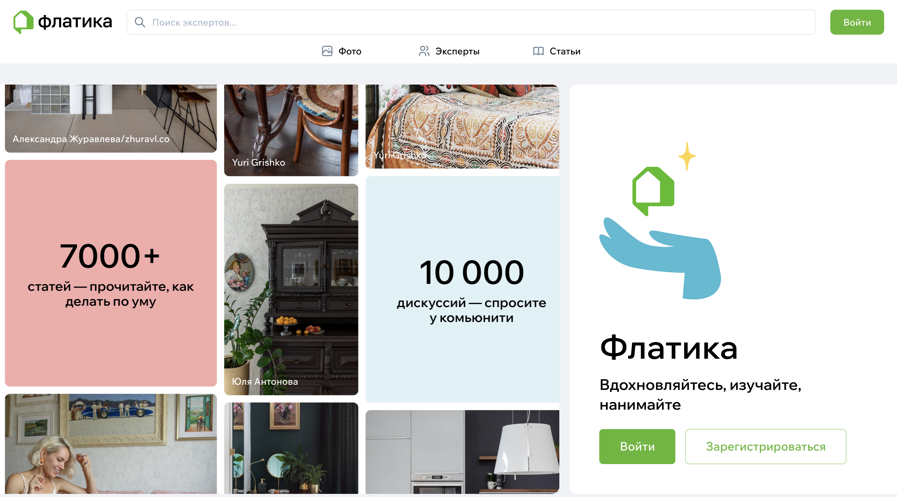
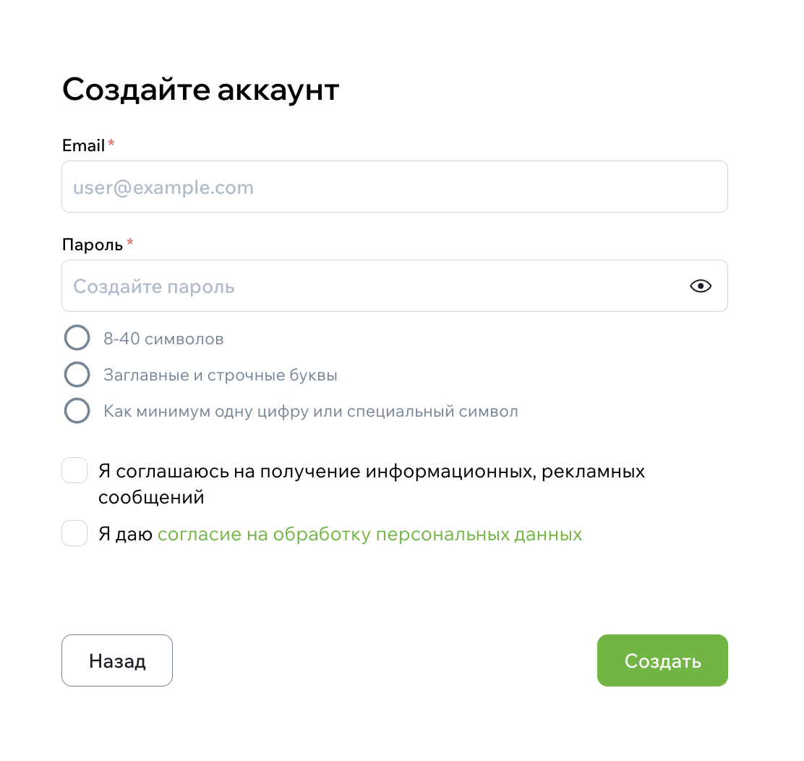

# Как зарегистрироваться

Регистрация нужна, чтобы сохранять идеи, писать отзывы, отправлять заявки экспертам и оформлять профессиональный профиль. Процесс занимает пару минут.

## Нажмите «Войти / Регистрация»

Перейдите на главную страницу Флатики и нажмите кнопку **«Войти / Регистрация»** в правом верхнем углу, а затем кнопку "зарегистрироваться" на открывшейся странице.

{style="display:block; margin:auto;" }
{width=400, style="display:block; margin:auto;" }

## Выберите тип профиля

На этом шаге система попросит определить, кто вы:

- **Обычный пользователь** — если вы ищете идеи, вдохновение, экспертов и решения.
- **Эксперт** — если вы дизайнер, архитектор, подрядчик, производитель мебели или другой специалист и хотите публиковать проекты и получать заявки.
- **Бренд** – если вы - представитель бренда.



Выберите подходящий вариант. Это влияет только на доступные инструменты — при желании тип профиля можно изменить позже.



{style="display:block; margin:auto;" }

## Укажите email и создайте пароль

После выбора типа профиля откроется форма регистрации.

Если вы продолжаете с email:

1. Введите адрес электронной почты.
2. Придумайте пароль или используйте подсказку менеджера паролей.
3. Проставьте галочку согласия с обработкой персональных данных.
4. Нажмите **«Создать»**.

{width=400, style="display:block; margin:auto;" }

## Подтвердите email

Мы отправим письмо с кнопкой подтверждения. Перейдите по ней, чтобы закончить регистрацию.

Если письмо не приходит несколько минут, проверьте папки **«Спам»** или **«Промоакции»**.

## Заполните начальную информацию

После подтверждения email появится короткая форма. Поля зависят от выбранного типа профиля.

### Если вы обычный пользователь:

- имя (можно указывать только имя),
- город,
- интересы (необязательно).

### Если вы эксперт:

- имя или название компании,
- специализация,
- город,
- аватар,
- ссылки на соцсети (по желанию).

Эти данные помогают системе подстроиться под вас: показывать актуальные фотографии и экспертов.

## Готово — можно пользоваться Флатикой

После шага настройки вы попадёте на сайт. Теперь доступно:

- просмотр фотопотока,
- создание альбомов идей,
- вопросы к фотографиям,
- просмотр проектов и статей,
- отправка заявок экспертам,
- публикация проектов (если вы эксперт).

## Если возникли сложности

Если не получается завершить регистрацию или подтверждение email — напишите нам в поддержку на сайте. Мы поможем.
