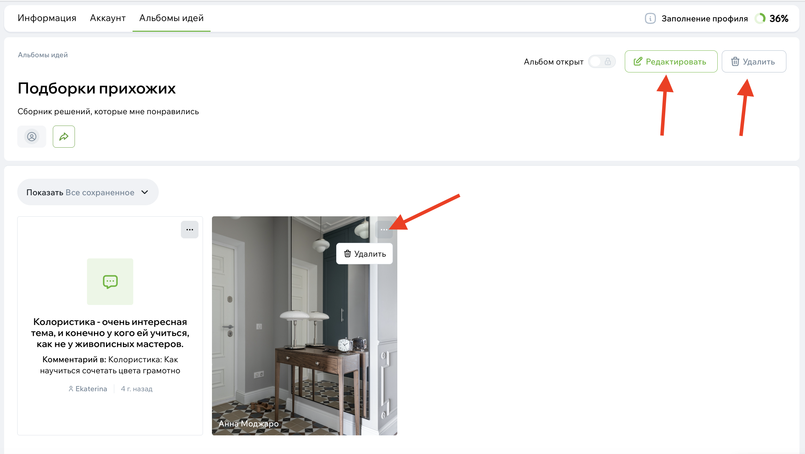

# Альбомы идей

Альбомы идей — это ваше личное пространство на Флатике.  
Здесь удобно собирать всё, что вам понравилось: фотографии, статьи, экспертов и небольшие заметки, чтобы не забыть важные детали.

Если вы делаете ремонт или только начинаете думать о нём, альбомы помогают держать мысли в порядке и не терять понравившиеся находки.

## Зачем нужны альбомы

Обычно, когда вы что-то ищете для интерьера, идей становится слишком много: одно понравилось в фотопотоке, другое — в статье, третье — просто запомнилось, но где сохранить?

Альбом решает эту проблему.  
Вы создаёте подборку под задачу — например, «кухня», «цветовые сочетания», «мебель, которая нравится» — и собираете всё туда.  
Позже можно вернуться и посмотреть свежим взглядом или обсудить с семьей или дизайнером.

## Как создать альбом

Самый простой способ — сохранить понравившееся фото или статью.  
Когда вы нажмёте кнопку **«Сохранить»**, вам предложат выбрать существующий альбом или создать новый.

Новый альбом начинается с названия. Можно назвать как угодно — главное, чтобы вы сами понимали, что там внутри.
По умолчанию альбом открыт, но при создании можно сразу сделать его приватным, если не хотите делиться подборкой.

{width=300, style="display:block; margin:auto;" }

## Что можно добавлять

В альбомы попадают самые разные типы материалов.  
Это может быть фотография из проекта, статья, эксперт, комментарий — всё, что помогло вам лучше понять своё направление.

## Редактирование альбома

Ваши альбомы доступны в профиле или по кнопке "мои идеи" в шапке сайте.

{width=700, style="display:block; margin:auto;" }

Когда вы открываете свой альбом, можно спокойно навести порядок:

- изменить название,
- уточнить описание,
- удалить лишние вещи,
- изменить доступность.

Обложка выбирается автоматически — это первое сохранённое фото. Если удалить его, обложка обновится.

{width=700, style="display:block; margin:auto;" }

Чтобы удалить объект из альбома, наведите на объект и нажмите на кнопку с троеточием. Выберите пункт "удалить".

Чтобы отредактировать название или описание альбома, нажмите на кнопку "Редактировать" в верхней части альбома.

Если хотите удалить альбом, нажмите соответствующую кнопку и подтвердите удаление.

## Доступность альбома

У альбома есть два режима:

**Открытый** — доступен всем. Можно делиться ссылкой, показывать подборку друзьям или дизайнеру.  
**Приватный** — виден только вам. Это удобно, если вы ещё не готовы показывать процесс или просто собираете идеи для себя.

## Что происходит внутри альбома

Когда материалов в альбоме становится много, он сам превращается в удобную ленту.  
Можно пролистывать содержимое, переходить к оригинальным страницам фотографий, читать свои заметки, удалять ненужное.

## Делитесь альбомами

Если вы сделали хорошую подборку, её можно отправить кому угодно: дизайнеру, родственникам, коллегам — через кнопку **«Поделиться»**.

Получатель увидит альбом так же, как и вы, если он открытый.

{width=600, style="display:block; margin:auto;" }
