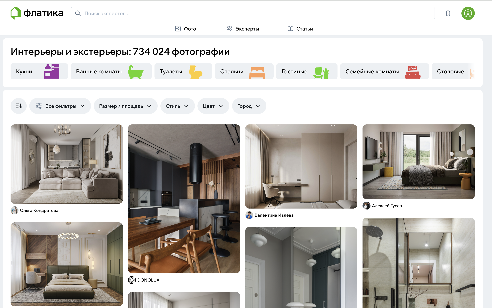
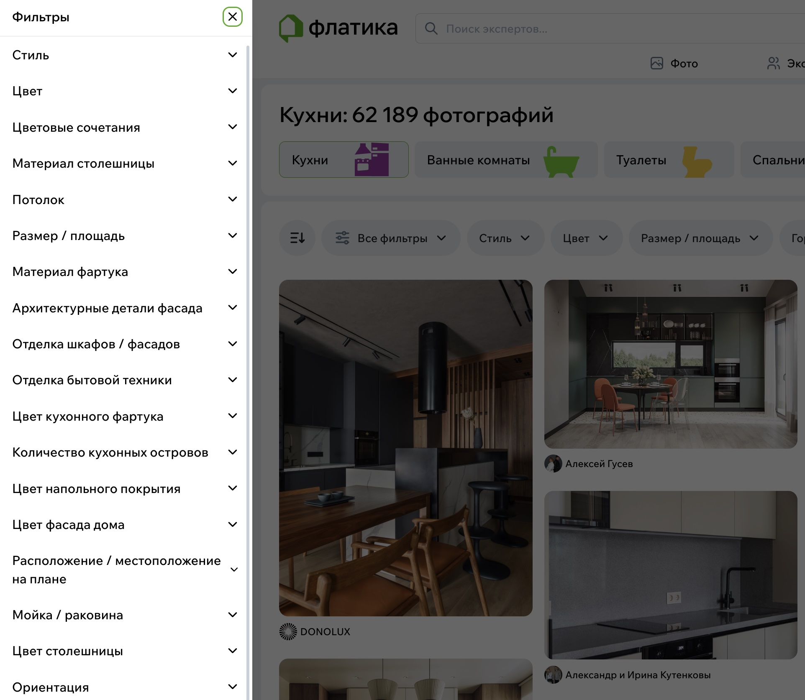
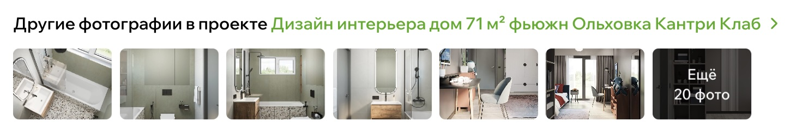
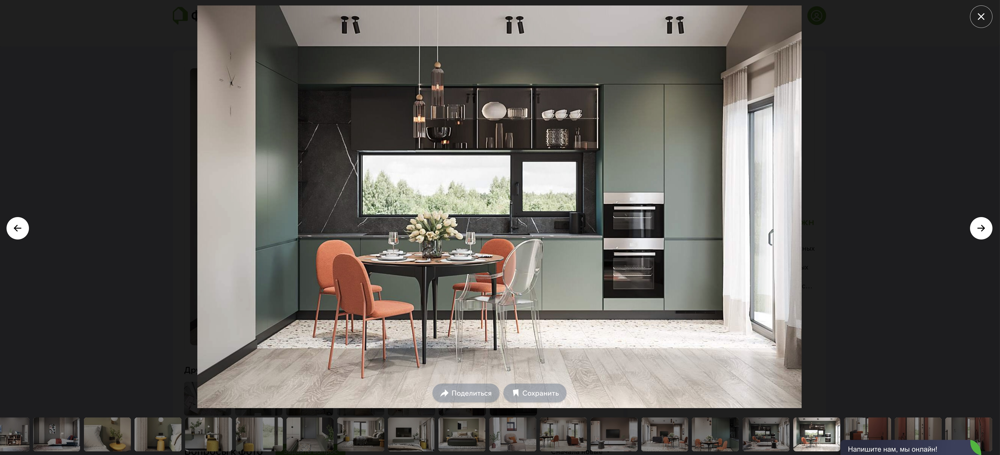
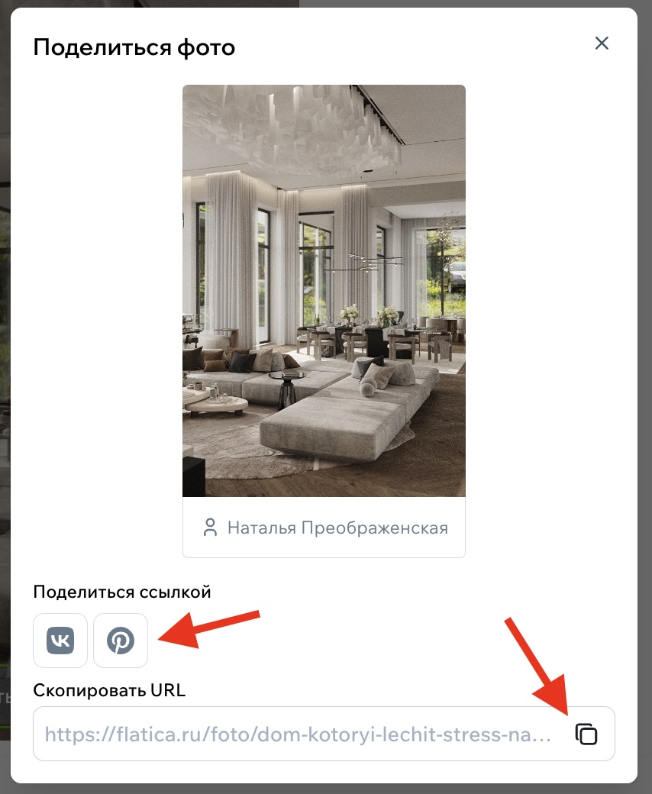

# Фотопоток

Фотопоток — это место, куда приходят за вдохновением.  
Большая лента интерьерных фотографий, собранных из реальных проектов дизайнеров и архитекторов.  
Здесь можно просто полистать красивые идеи или быстро найти решение под конкретную задачу: «как отделать кухню», «какой выбрать цвет стен», «что сделать с маленькой ванной».

## Как выглядит фотопоток

Лента устроена просто: вы прокручиваете страницу вниз, а система подгружает всё новые и новые фотографии.  
Каждый снимок — часть реального проекта. Он уже прошёл модерацию, поэтому лента всегда выглядит аккуратно и вдохновляюще.

{style="display:block; margin:auto;" }

## Как пользоваться фильтрами

Если хочется не просто смотреть, а найти что-то конкретное, можно настроить фильтры.  
Они помогают сузить выбор и показывают именно те идеи, которые подходят под вашу ситуацию.

Вы можете выбрать категорию — например, кухня или спальня — указать стиль, цветовую гамму или размер помещения. Если знаете бюджет или город, можно включить и эти параметры.

Для некоторых категорий есть свои особенности. Например, для кухонь фильтры помогут выбрать фасады, планировку или наличие острова.

Когда вы меняете параметры, лента перестраивается сразу же, без перезагрузки страницы.

{width=500, style="display:block; margin:auto;" }

## Что находится внутри фотографии

Когда вы нажимаете на фото, открывается отдельная страница.  
Там можно посмотреть его в большем размере, узнать, кто автор проекта, перейти в профиль эксперта и прочитать небольшое описание.

Если фотография — часть большого проекта, рядом появятся и другие изображения из этой же съёмки. Их можно пролистать, открыть на полный экран, рассмотреть детали.

{width=800, style="display:block; margin:auto;" }

## Другие снимки проекта

Под фотографией почти всегда есть мини-галерея — как бы «продолжение истории».  
Она помогает увидеть пространство целиком: не только один ракурс, но и соседние комнаты, детали или другие зоны.

{width=500, style="display:block; margin:auto;" }

## Просмотр на весь экран

Если хотите рассмотреть что-то внимательнее — плитку, швы, фактуру дерева — нажмите на иконку разворота.  
Фото откроется на весь экран и удобно подстроится под ваше устройство. Можно листать стрелками и двигаться вперёд-назад.

{style="display:block; margin:auto;" }

## Вопросы к фото

Под каждой фотографией есть раздел с вопросами.  
Если вы хотите уточнить цвет краски, модель светильника, производителя плитки — смело задавайте вопрос. Эксперт получит уведомление и сможет ответить.

Формат простой: вы пишете вопрос, отправляете — и он появляется в списке.  
Там же можно поставить «лайк» чужому вопросу или пожаловаться на комментарий, если он нарушает правила.

Ответы появляются прямо под фото — их видят все пользователи.

{width=500, style="display:block; margin:auto;" }

## Сохранение фото в альбом

Если снимок понравился, вы можете сохранить его в [альбом идей](Альбомы.md).  
Это удобно, когда нужно собрать подборку: для будущей кухни, для ремонта спальни, чтобы обсудить всё с дизайнером или просто не забыть хорошее решение.

Альбомы хранятся в вашем профиле, открываются в одно нажатие.

{width=300, style="display:block; margin:auto;" }

## Поделиться фотографией

И, конечно, если вы хотите показать фото кому-то — другу, дизайнеру, члену семьи — просто нажмите кнопку **«Поделиться»**.  
Можно скопировать ссылку, отправить в мессенджер или выложить в соцсеть.

{width=300, style="display:block; margin:auto;" }
