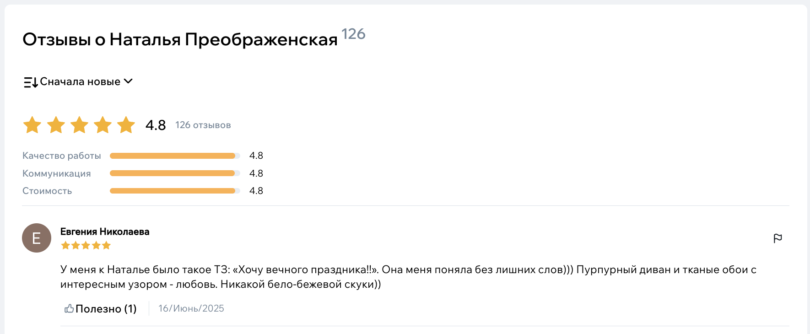

# Как оставить отзыв экспертам

Отзывы — важная часть Флатики.  
Они помогают другим людям понять, как эксперт работает в реальной жизни: общение, качество, сроки, отношение к задаче.  
Если у вас был опыт сотрудничества, отзыв — лучший способ сказать «спасибо» или честно рассказать, что пошло не так.

## Где найти кнопку «Оставить отзыв»

Самый простой путь — зайти в профиль эксперта.  
Прокрутите страницу немного вниз — там есть раздел **«Отзывы»**.  
В нём отображаются все комментарии от клиентов, и там же находится кнопка **«Написать отзыв»**.

{width=700, style="display:block; margin:auto;" }

Если вы не помните имя эксперта, можно воспользоваться поиском в каталоге: достаточно ввести название студии или фамилию — система подскажет варианты.

## Что написать в отзыве

Когда вы нажмёте «Написать отзыв», откроется форма.  
Не нужно писать что-то сложное. Подумайте о нескольких вещах:

- что именно вы делали вместе (дизайн-проект, ремонт, консультация),
- что понравилось,
- что было непросто,
- помог ли эксперт разобраться в деталях,
- соблюдались ли сроки.

Просто опишите свой опыт — так, как рассказали бы знакомому.

{width=500, style="display:block; margin:auto;" }

## Выбор оценки

Перед текстом вам предложат поставить оценку специалисту.  
Оценка помогает другим людям быстрее понять, довольны ли вы сотрудничеством, но главное — ваш текстовый комментарий.  
Если хотите, можете оставить короткое сообщение: «всё прошло отлично» — это тоже полезно.

## Что происходит после отправки

Когда вы отправите отзыв:

- он попадёт на проверку модерации,
- отзыв станет виден всем пользователям после публикации.

## Если отзыв ещё не появился

Если прошло много времени, а отзыва нет:

- проверьте, не пришло ли письмо от Флатики с уточняющими вопросами,
- попробуйте написать в поддержку — мы подскажем, на каком этапе проверка.

## Зачем писать отзывы

Отзывы — это не только обратная связь экспертам.  
Они формируют культуру честного взаимодействия: помогают другим пользователям выбрать специалиста, а хорошим экспертам — находить больше клиентов.

Если вы готовы поделиться своим опытом, это действительно кому-то поможет.

Вы можете посмотреть отзывы других пользователей, а также отметить полезные, нажав на кнопку «Полезно» рядом с соответствующим отзывом.

Вы можете отфильтровать отзывы по полезности, дате или рейтингу.

{width=700, style="display:block; margin:auto;" }
