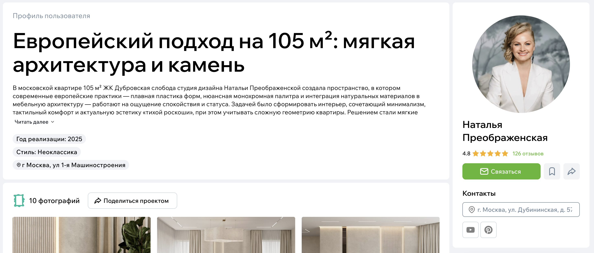
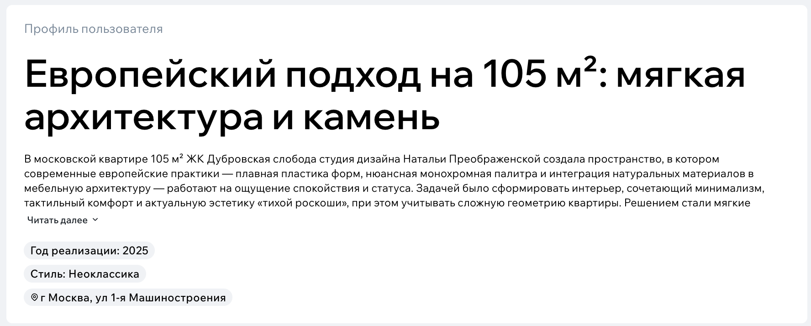

# Проекты

Раздел «Проекты» — это библиотека реализованных работ экспертов: квартиры, дома, коммерческие пространства и любые другие объекты.  
Этот раздел помогает увидеть реальные примеры, сравнить подходы разных специалистов и выбрать эксперта, чьи работы вам ближе.

Проект — это не просто набор фото, а полноценная история: задача, решения, планировки, стоимость и визуальные материалы.

## Что показывает проект

Каждая страница проекта содержит:

- обложку (главное фото),
- галерею фотографий,
- планировки (если есть),
- описание задачи,
- стиль и концепцию,
- информацию об объекте (площадь, тип помещения, год реализации),
- ориентировочную стоимость (если указана),
- ссылки на эксперта, который вел проект.

Проект удобно рассматривать: фото можно листать, открывать на весь экран и переходить к другим изображениям.

{style="display:block; margin:auto;" }

## Галерея фото

Внутри проекта фотографии уже отсортированы и разделены по типу. Эксперт оформляет их заранее, поэтому пользователю удобнее ориентироваться.

Типы изображений:

- **съёмка** — итоговые фотографии,
- **до ремонта** — исходные виды помещений,
- **3D-визуализации** — если делались,
- **планировки** — чертежи, схемы и поэтажные планы.

Можно:

- листать фото,
- открывать на полный экран,
- переходить к связанным материалам (например, к странице отдельной фотографии).

{style="display:block; margin:auto;" }

## Описание проекта

Эксперт указывает:

- задачу, которую решал,
- особенности объекта,
- ключевые принципы решения,
- применённые материалы или подходы,
- сложные моменты и как они были решены.

Этот блок помогает понять контекст и увидеть, насколько подход специалиста подходит под ваши задачи.

{style="display:block; margin:auto;" }

В каждом проекте есть ссылка на профиль автора. Вы можете перейти в профиль эксперта, посмотреть другие работы или оставить заявку.

## Что можно делать с проектом

Вы можете:

- просматривать все фотографии,
- сохранять понравившиеся фото в свои [альбомы](../Альбомы.md),
- задавать вопросы к отдельным фотографиям,
- перейти к профилю эксперта,
- поделиться ссылкой на проект.
