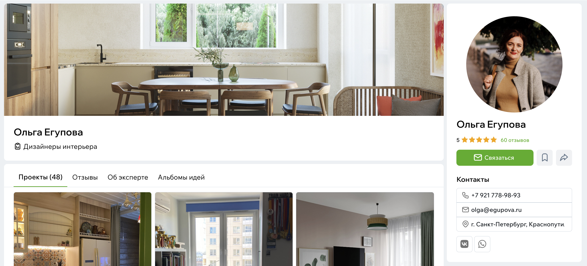
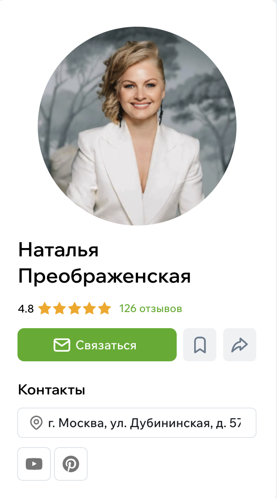

# Профиль эксперта

Профиль эксперта — это его публичная «визитка» на Флатике.  
Здесь пользователи знакомятся со специалистом: смотрят его работы, читают описание, изучают стиль, чтобы понять, подходит ли он под их задачу и комфортно ли будет с ним работать.

## Первое впечатление

В шапке профиля — всё самое важное: имя или название студии, город, специализация и обложка, по которой сразу считывается настроение работ.  
Это то, на что человек смотрит первым делом, чтобы понять, в правильное ли место он попал.

{style="display:block; margin:auto;" }

## Немного о специалисте

Далее — рассказ о себе. Здесь эксперт пишет о том, чем он занимается, какие проекты ему ближе, в каких направлениях работает и какой у него опыт.  
Кто-то указывает, в каких городах работает, кто-то — ориентировочные цены или ключевые компетенции.

Если это компания или бренд, рядом может быть и юридическая информация — она помогает понять, что перед нами официальная компания.

{style="display:block; margin:auto;" }

## Работы и проекты

Самая насыщенная часть профиля — [проекты](Проекты.md).  
В них видно, как специалист мыслит, какие задачи он решает и в каком стиле работает.

Проекты обычно включают фотографии, описания задач, детали реализации, планировки и, если эксперт их указывает, ориентировочную стоимость.  
Это помогает увидеть подход, уровень аккуратности и то, насколько работа эксперта соотносится с вашим вкусом.

{style="display:block; margin:auto;" }

Если что-то понравилось, можно открыть проект целиком и посмотреть его подробнее.

## Отзывы

[Отзывы](./Отзывы-экспертам.md) — это честные впечатления людей, которые уже работали с экспертом.  
По ним проще понять, насколько специалист ответственен, как он общается и соблюдает ли сроки.

В каждом отзыве видно дату, имя клиента и сам текст, а рядом — общий рейтинг. Все отзывы проходят модерацию, поэтому пользоваться ими безопасно.

{width=600, style="display:block; margin:auto;" }

## Альбомы идей

Некоторые эксперты собирают вдохновляющие подборки — свои [альбомы идей](../Альбомы.md).  
Это может быть подборка понравившихся решений, референсов или просто материалов, с которыми приятно работать.

Если альбом открыт, вы можете заглянуть внутрь, посмотреть идеи и сохранить что-то к себе.

{width=600, style="display:block; margin:auto;" }

## Как связаться со специалистом

Если вы понимаете, что хотите обсудить задачу — в профиле есть кнопка **«Связаться»**.  
Она открывает простую форму, где можно кратко описать задачу: тип объекта, примерный бюджет, сроки или формат работы, если вы это уже знаете.

Эксперт получит вашу [заявку](Оставить-заявку.md) и ответит в удобное время.  
Если специалист оставил открытыми прямые контакты — телефон или почту — вы можете написать ему напрямую. Лучше упомянуть, что нашли его на Флатике: это помогает эксперту понимать, откуда пришла заявка.

{width=300, style="display:block; margin:auto;" }
