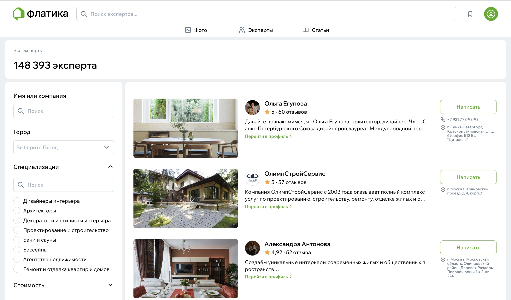
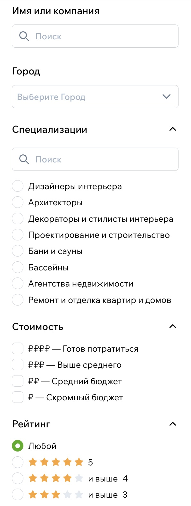
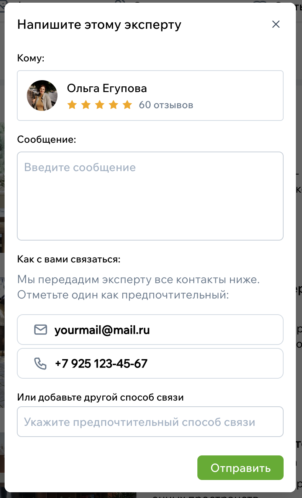

# Каталог экспертов

Каталог экспертов — это место, где можно найти людей, которые действительно помогают с ремонтом и интерьерами. Дизайнеры, архитекторы, мастера ремонта, подрядчики, мебельные бренды — все они представлены в одном разделе.

Каждый эксперт имеет свой профиль: проекты, опыт, отзывы, стиль работы. Это удобный способ увидеть реальную картинку до того, как вы решите написать специалисту.

{style="display:block; margin:auto;" }

## Как устроен каталог

Каталог напоминает «витрину» специалистов. Его можно просто листать, но чаще люди заходят сюда с конкретной задачей. Чтобы быстрее найти подходящего эксперта, можно использовать фильтры.  
Они позволяют выбрать город, тип услуг или специализацию, а если эксперт указывает ценовой сегмент, можно отфильтровать и по нему.

Когда вы меняете параметры, каталог обновляется сразу — никаких лишних переходов.

{width=200, style="display:block; margin:auto;" }

## Как выглядит карточка эксперта

Каждый специалист представлен аккуратной карточкой. На ней видно имя или название компании, город, основную специализацию, обложку из портфолио и рейтинг, если есть отзывы. Иногда специалист указывает немного о себе — это помогает понять его стиль работы ещё до перехода в профиль.

Если карточка вам откликнулась, просто нажмите — откроется полноценный профиль с проектами, описанием и контактами.

{style="display:block; margin:auto;" }

## Как отправить заявку эксперту

Когда вы нашли специалиста, с которым хотите связаться, сделать это можно прямо из каталога. В карточке есть кнопка **«Написать»** — она открывает небольшую форму.

Обычно достаточно описать задачу в нескольких предложениях: что вы хотите сделать, какая площадь, на какие сроки рассчитываете. Если у вас уже есть предпочтительный способ связи, его можно выбрать из профиля — или просто оставить контакт вручную.

После отправки заявка попадает к эксперту в личный кабинет, и он сможет ответить вам напрямую.

{width=300, style="display:block; margin:auto;" }

## Как понять, что эксперт вам подходит

Иногда выбор даётся непросто — дизайнеров и студий много, и у каждого свой почерк.  
Чтобы определиться, можно открыть профиль специалиста: посмотреть его проекты, почитать отзывы, сравнить стиль с другими экспертами. Если кто-то понравился, но вы ещё не готовы писать, просто сохраните профиль в альбом идей — так удобнее возвращаться к выбранным кандидатам позже.

Каталог создан именно для этого: чтобы вы быстро нашли человека, с которым вам будет комфортно работать.
